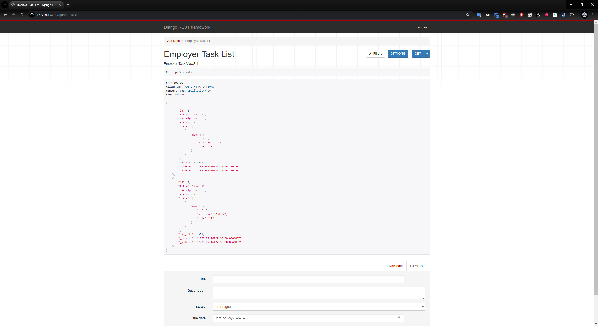

# Task Management Application.

This is a simple task management application that allows users to create, read, update, and delete tasks.

- Employees can see and update their tasks.
- Employers can create, read, update, and delete tasks.

## Installation

To install the app, you need to have the following installed:

- Python 3.8 or higher

Install all requirements by running:

```bash
pip install -r requirements.txt
```

## Usage

To run the app, run the following command:

```bash
cd src && PYTHONPATH=. python manage.py runserver
```

## Run by Docker

To run the app by Docker, run the following command:

```bash
docker-compose up
```

Docker will build the image and run the container. The app will be available at http://localhost:8099.

- Admin account is created with username `admin` and password `admin`. Remember to change the password after login. You can config the admin password in `docker-compose.yml` file.
- Admin page is available at http://localhost:8099/admin.
- Swagger API documentation is available at http://localhost:8099/swagger.
- Redoc API documentation is available at http://localhost:8099/redoc.
- You can either use the Rest Document for each domain. Example: http://localhost:8099/api/v1/tasks/

Demo video is available at https://youtu.be/Rt6Uqf2oZvM

Demo images:

1. My tasks:
   

2. Employer tasks:
   

3. Order tasks:
   

4. Filter tasks:
   

5. Swagger API documentation:
   
